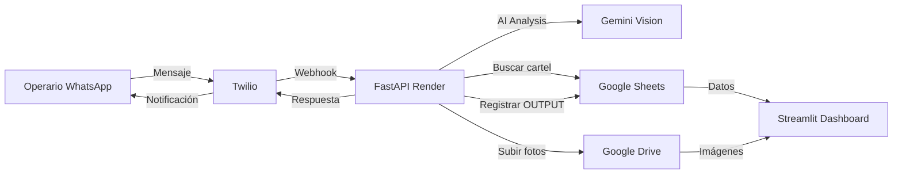

<div align="center">
  
  <picture>
    <source media="(prefers-color-scheme: dark)" srcset="data/Logo original - Fondo negro - 1057 x 511 px.png">
    <source media="(prefers-color-scheme: light)" srcset="data/Logo original - 1.600x772 px.png">
    
  </picture>
  
  # VialP ECOGAS
  ### Sistema Inteligente de Gestión de Cartelería para Gasoductos
  
  [](https://www.python.org/downloads/)
  [](https://fastapi.tiangolo.com/)
  [](https://streamlit.io/)
  [](https://render.com/)
  
  **Gestión automatizada de 287+ carteles en la red de gasoductos ECOGAS Argentina**
  
  [Características](#-características-principales) • [Instalación](#-instalación) • [Uso](#-uso) • [Arquitectura](#-arquitectura) • [Producción](#-producción)
</div>

---

## 🌟 Acerca del Proyecto

Sistema completo de gestión de cartelería vial para la infraestructura de gasoductos de ECOGAS, integrando inteligencia artificial, geolocalización GPS y comunicación WhatsApp para optimizar el flujo de trabajo de los operarios en campo.

## 🎯 Características Principales

### 🤖 Inteligencia Artificial
- **Gemini Pro Vision** para análisis de imágenes de carteles
- **Detección automática** de tipo de cartel y estado
- **Multi-item workflow** - procesar múltiples items simultáneamente (ej: "277, 278, 279")

### 📱 Integración WhatsApp
- **Conversación natural** con operarios en campo vía Twilio
- **Comandos simples**: enviar número de item, fotos antes/después, y "listo"
- **Notificaciones en tiempo real** de trabajos completados
- **Registro automático** en planilla OUTPUT con enlaces a fotos

### 🗺️ Geolocalización Inteligente
- **287+ carteles** georreferenciados en toda la red ECOGAS
- **Búsqueda por proximidad** (radio 5km)
- **Validación GPS** de coordenadas en territorio argentino
- **Mapa interactivo** con filtros por gasoducto y tipo

### 📊 Dashboard Ejecutivo
- **Métricas en tiempo real**: trabajos completados, ramales activos, stock
- **Visualización geográfica** con Folium
- **Sistema de autenticación** multi-usuario (admin/viewer)
- **Análisis de tiempos** y productividad
- **Gestión de stock** con alertas automáticas

### ☁️ Cloud & Storage
- **Google Drive** - almacenamiento organizado por item (Fotos XXX-001 al 006)
- **Google Sheets** - integración bidireccional con planilla ECOGAS
- **Render** - API producción 24/7
- **Streamlit Cloud** - dashboard público con autenticación opcional

## �️ Stack Tecnológico

| Componente | Tecnología | Versión |
|-----------|------------|---------|
| **Backend API** | FastAPI | 0.115+ |
| **Runtime** | Python | 3.13 |
| **AI/ML** | Google Gemini Pro Vision | 1.5 |
| **WhatsApp** | Twilio API | - |
| **Storage** | Google Drive API | v3 |
| **Database** | Google Sheets API | v4 |
| **Frontend** | Streamlit | 1.41+ |
| **Maps** | Folium + Geopy | - |
| **Production API** | Render | - |
| **Production Dashboard** | Streamlit Cloud | - |

### 📦 Dependencias Principales

```python
fastapi>=0.115.6
google-generativeai>=0.8.6
gspread>=6.1.4
twilio>=9.4.1
streamlit>=1.41.1
folium>=0.19.4
pandas>=2.2.3
httpx>=0.28.1
```

## 🚀 Instalación

```bash
# Clonar repositorio
cd VialP_Ecogas

# Crear entorno virtual
python -m venv vialp
source vialp/bin/activate  # En Windows: vialp\Scripts\activate

# Instalar dependencias
pip install -r requirements.txt

# Configurar variables de entorno
cp .env.example .env
# Editar .env con tus credenciales
```

## ⚙️ Configuración

### 1. Google Cloud APIs

1. Crear proyecto en Google Cloud Console
2. Habilitar APIs: Sheets API, Drive API
3. Crear Service Account y descargar `credentials.json`
4. Compartir planilla ECOGAS con el email del Service Account
5. Obtener Gemini API Key desde [Google AI Studio](https://makersuite.google.com/app/apikey)

### 2. Twilio WhatsApp

1. Crear cuenta en [Twilio](https://www.twilio.com)
2. Configurar WhatsApp Sandbox
3. Obtener Account SID y Auth Token
4. Configurar webhook con ngrok

### 3. Variables de Entorno

Configurar en `.env`:

```env
# Gemini AI
GEMINI_API_KEY=tu_api_key

# Google Sheets
GOOGLE_SHEETS_CREDENTIALS_PATH=credentials.json
ECOGAS_SHEET_ID=1d2WIsyCIETfMdRgSoE3nk9-bxIO_sySKqTVJHVwMV8Q
IMAGENES_CARTELES_FOLDER_ID=1QszrmYD6QwFpu_M8Wsg9T1PPr6tJPzls

# Twilio WhatsApp
TWILIO_ACCOUNT_SID=tu_account_sid
TWILIO_AUTH_TOKEN=tu_auth_token
TWILIO_WHATSAPP_NUMBER=whatsapp:+14155238886
ADMIN_WHATSAPP_NUMBER=whatsapp:+549XXXXXXXXXX

# Database
DATABASE_URL=sqlite:///./vialp.db
```

## 🎮 Uso

### Iniciar Backend API

```bash
# Activar entorno virtual
source vialp/bin/activate

# Iniciar servidor FastAPI
uvicorn app.main:app --reload --port 8000
```

### Iniciar Túnel ngrok

```bash
# En otra terminal
ngrok http 8000

# Copiar URL HTTPS y configurar en Twilio webhook:
# https://XXXXX.ngrok-free.app/webhook/whatsapp
```

### Iniciar Dashboard de Demo

```bash
# En otra terminal con el entorno activado
streamlit run dashboard/demo.py
```

El dashboard estará disponible en: `http://localhost:8501`

## 📱 Flujos de Trabajo WhatsApp

### 🔹 Modo Single Item (tradicional)

1. **Operario envía número**: `"190"`
2. **Sistema responde**: Info del cartel encontrado
3. **Operario envía 3 fotos ANTES**: Sistema las guarda en Drive
4. **Operario confirma**: `"listo 190"`
5. **Sistema pide fotos DESPUÉS**: Confirmación
6. **Operario envía 3 fotos DESPUÉS**: Sistema las guarda
7. **Operario confirma final**: `"listo 190"`
8. **✅ Sistema registra en OUTPUT**: Con enlaces a fotos y notificación

### 🔹 Modo Multi-Item (optimizado)

1. **Operario lista items**: `"277, 278, 279"`
2. **Sistema procesa en lote**: Info de los 3 carteles
3. **Operario envía 3 fotos ANTES del primero**: `"277"`
4. **Confirma**: `"listo 277"`
5. **Sistema automáticamente pide siguiente**: `"278"`
6. **Proceso continúa** hasta completar todos
7. **✅ Todos registrados automáticamente** en OUTPUT

### 💬 Comandos Disponibles

- **Iniciar trabajo**: `190` o `277, 278, 279`
- **Confirmar fotos ANTES**: `listo 190`
- **Confirmar fotos DESPUÉS**: `listo 190`
- **Estado actual**: Sistema responde automáticamente
- **Ayuda**: `hola` o `ayuda`

### 📸 Gestión de Fotos

- **Carpetas automáticas** en Drive: `/Item XXX/`
- **Nomenclatura estándar**: 
  - ANTES: `Fotos XXX-001`, `XXX-002`, `XXX-003`
  - DESPUÉS: `Fotos XXX-004`, `XXX-005`, `XXX-006`
- **Enlaces en planilla** OUTPUT columnas Z (ANTES) y AA (DESPUÉS)

## 🌐 Producción

### API Backend (Render)
- **URL**: https://vialparking-agentai-e.onrender.com
- **Webhook**: `/webhook/whatsapp`
- **Health Check**: `/health`
- **Auto-deploy**: Desde GitHub main branch
- **Environment Variables**: Configuradas en Render Dashboard

### Dashboard (Streamlit Cloud)
- **Acceso público**: Solo visualización
- **Login opcional**: Para funciones de edición
- **Usuarios**:
  - `admin`: Acceso completo (editar WhatsApp, Stock, Empleados)
  - `jime`: Administrador
  - `operador`: Solo visualización
- **Secrets**: Configurados en Streamlit Cloud
- **Auto-redeploy**: Cada push a GitHub

### Twilio WhatsApp
- **Número Producción**: +12495440560
- **Webhook configurado**: Apunta a Render URL
- **Sandbox**: Desactivado (comentado en código)

### Credenciales y Secrets

#### Render (Variables de Entorno)
```bash
GEMINI_API_KEY=xxx
TWILIO_ACCOUNT_SID=xxx
TWILIO_AUTH_TOKEN=xxx
TWILIO_WHATSAPP_NUMBER=whatsapp:+12495440560
ECOGAS_SHEET_ID=1d2WIsyCIETfMdRgSoE3nk9-bxIO_sySKqTVJHVwMV8Q
OUTPUT_SHEET_ID=1qKQxWRcN1bjbavw2BgYPjh0rA0VaoaDfTHt_8COAVKw
# ... otros IDs
```

#### Streamlit Cloud (secrets.toml)
```toml
GOOGLE_SHEETS_CREDENTIALS_JSON = '''
{
  "type": "service_account",
  "project_id": "vialp-xxx",
  ...
}
'''

[users.admin]
password = "hash_sha256"
role = "admin"
```

Ver [STREAMLIT_DEPLOY.md](STREAMLIT_DEPLOY.md) para guía completa de deployment.

## 🗂️ Arquitectura del Proyecto

```
VialP_Ecogas/
├── 📁 app/                       # 🔥 FastAPI Backend
│   ├── main.py                   # Webhook Twilio + Multi-item workflow
│   ├── models.py                 # Modelos SQLAlchemy
│   └── database.py               # Config SQLite
│
├── 📁 agent/                     # 🤖 Agente AI
│   └── gemini_agent.py           # Gemini Pro Vision integration
│
├── 📁 services/                  # ⚙️ Servicios
│   ├── whatsapp.py              # Twilio WhatsApp API
│   ├── google_sheets.py         # Sheets + Drive (1680 líneas)
│   ├── geolocation.py           # Cálculos GPS y validación
│   └── credentials_helper.py    # Manejo de credenciales
│
├── 📁 dashboard/                 # 📊 Frontend Streamlit
│   ├── production.py            # Dashboard producción (2600+ líneas)
│   ├── demo.py                  # Dashboard demo/desarrollo
│   ├── app.py                   # Dashboard básico
│   └── PRODUCTION_README.md     # Guía del dashboard
│
├── 📁 data/                      # 📂 Recursos
│   ├── Logo original - 1.600x772 px.png
│   ├── Gasoductos.png
│   └── Cañerias.png
│
├── 📁 vialp/                     # 🐍 Virtual Environment
│
├── 📄 credentials.json           # Service Account (no committear)
├── 📄 credentials_oauth.json     # OAuth Drive (no committear)
├── 📄 token_drive.pickle         # Token Drive OAuth
├── 📄 requirements.txt           # Dependencias Python
├── 📄 .env                       # Variables entorno (no committear)
├── 📄 render.yaml                # Config Render deployment
├── 📄 README.md                  # Este archivo
├── 📄 QUICK_START.md            # Inicio rápido
├── 📄 DEPLOY.md                 # Guía deployment Render
└── 📄 STREAMLIT_DEPLOY.md       # Guía deployment Streamlit Cloud
```

### 📊 Flujo de Datos



## � Planillas y Datos

### Google Sheets - Planilla ECOGAS (INPUT)
- **ID**: `1d2WIsyCIETfMdRgSoE3nk9-bxIO_sySKqTVJHVwMV8Q`
- **287+ carteles** con georreferencias completas
- **Columnas principales**:
  - `A`: N° Item
  - `B-C`: Gasoducto/Ramal
  - `D`: Tipo de cartel (D, T, G, etc.)
  - `J-K`: Coordenadas GPS (lat, lon)
  - `M`: Observaciones
- **Uso**: Base de datos master de carteles

### Google Sheets - Planilla OUTPUT (REGISTROS)
- **ID**: `1qKQxWRcN1bjbavw2BgYPjh0rA0VaoaDfTHt_8COAVKw`
- **Hoja**: "Insta Señalizaciones Anexo 2"
- **Columnas principales**:
  - `D`: Fecha Ejecución
  - `F`: N° del item
  - `G`: Gasoducto/Ramal
  - `I`: Ubicación
  - `J`: Coordenadas
  - `O`: Tipo de trabajo
  - `Z`: FOTOS ANTES (enlace Drive)
  - `AA`: FOTOS DESPUÉS (enlace Drive)
- **Headers**: Filas 9-10, datos desde fila 11
- **Uso**: Registro automático de trabajos completados

### Google Drive - Almacenamiento
- **Carpeta Imágenes Carteles**: Items individuales
- **Carpeta OUTPUT Imágenes**: `19YQCBODmkk_dCssMBB2GuNPfQs5oaUmV`
- **Estructura**: `/Item XXX/Fotos XXX-001` al `006`
- **Permisos**: Service Account con acceso de escritura

### SQLite Local (Desarrollo)
- **vialp.db**: Base de datos SQLite local
- **Tablas**: 
  - `trabajos`: Historial de intervenciones
  - `conversaciones`: Log de mensajes WhatsApp
  - `empleados`: Datos de operarios
- **Uso**: Desarrollo y testing local

## 📊 Dashboard Features

### 📈 Dashboard Principal
- **Métricas en tiempo real**: 287 carteles, % ejecutados, ramales activos
- **Mapa interactivo**: Folium con cluster markers
- **Filtros**: Por gasoducto, tipo, estado
- **Cards de resumen**: Stock, trabajos hoy, empleados activos

### 📋 Órdenes de Trabajo
- **Tabla completa** de trabajos en OUTPUT
- **Filtros**: Por tipo, ramal, fecha
- **Último trabajo**: Card con detalles y enlace a fotos
- **Actualización**: Botón refresh + caché de 10 seg
- **Indicador**: Última actualización, fila leída, item

### 💬 WhatsApp Integration
- **Flujo del sistema**: Diagrama visual single/multi-item
- **Registrar desde PC**: Form manual de registro
- **Trabajos registrados**: Tabla con métricas
- **Estado en tiempo real**: Conectado con Render API

### 📦 Gestión de Stock
- **Inventario completo**: Por tipo de cartel
- **Alertas**: Stock bajo (<5 unidades)
- **Historial**: Movimientos de entrada/salida
- **Registro**: Form de actualización (solo admin)

### 👥 Empleados
- **Lista completa**: DNI, nombre, rol, estado
- **Agregar nuevo**: Form con validación
- **Editar**: Estado activo/inactivo
- **Permisos**: Solo admin puede modificar

### 🗺️ Mapa Interactivo
- **287+ markers**: Color por estado (pendiente/ejecutado/en proceso)
- **Popup info**: Item, gasoducto, tipo, observaciones
- **Cluster markers**: Agrupación automática
- **Filtros**: Por gasoducto y tipo
- **Full screen**: Modo pantalla completa

## 🔐 Sistema de Autenticación

### Roles de Usuario

| Rol | Acceso | Funcionalidades |
|-----|--------|-----------------|
| **Público** | Dashboard completo | ✅ Ver todo, ❌ No editar |
| **Viewer** | Login opcional | ✅ Ver todo, ❌ No editar |
| **Admin** | Login requerido | ✅ Ver y editar todo |

### Funciones Protegidas (Requieren Login Admin)
- ⚠️ Registrar trabajos desde PC (pestaña WhatsApp)
- ⚠️ Registrar movimientos de stock
- ⚠️ Agregar/editar empleados
- ⚠️ Acciones que modifican planillas

### Usuarios Configurados
- Ver `STREAMLIT_DEPLOY.md` para configurar usuarios en Streamlit secrets
- Contraseñas hasheadas con SHA256
- Login en sidebar con expander

## 🔧 Desarrollo

### Testing Local

```bash
# Test webhook localmente
python -c "from services.google_sheets import GoogleSheetsService; gs = GoogleSheetsService(); print(gs.obtener_carteles_ecogas()[:3])"

# Test geolocalización
python -c "from services.geolocation import GeolocationService; geo = GeolocationService(); print(geo.validar_en_argentina(-33.16225, -64.38010))"
```

### Logs

```bash
# Ver logs del servidor
tail -f uvicorn.log

# Verificar proceso
ps aux | grep uvicorn
```

## 🐛 Troubleshooting

### Dashboard no actualiza datos

**Síntoma**: Streamlit Cloud muestra datos antiguos

**Solución**:
1. Presionar botón "🔄 Actualizar Datos"
2. Verificar indicador de última actualización
3. Confirmar que `st.secrets` están configurados correctamente
4. Reboot app desde Streamlit Cloud dashboard

### Webhook no recibe mensajes WhatsApp

**Síntoma**: Mensajes WhatsApp no llegan al sistema

**Solución**:
1. Verificar URL webhook en Twilio Console
2. Debe apuntar a: `https://vialparking-agentai-e.onrender.com/webhook/whatsapp`
3. Verificar que Render API esté activa (puede estar en sleep)
4. Revisar logs en Render dashboard

### Error de credenciales en Streamlit Cloud

**Síntoma**: "❌ Sistema en modo limitado"

**Solución**:
1. Verificar `GOOGLE_SHEETS_CREDENTIALS_JSON` en Streamlit secrets
2. Puede ser dict o string JSON (el código maneja ambos)
3. Verificar todos los IDs de sheets en secrets
4. Ver logs de Streamlit para mensajes detallados

### Google Sheets API error

**Síntoma**: Error 403 o 404 al acceder planillas

**Solución**:
1. Verificar que Service Account tiene permisos en la planilla
2. Share planilla con email del Service Account
3. Sheet ID correcto en variables de entorno
4. Verificar que no haya límites de API excedidos

### Multi-item no funciona

**Síntoma**: No procesa múltiples items

**Solución**:
1. Formato correcto: `"277, 278, 279"` (con comas)
2. Verificar que todos los items existen en planilla ECOGAS
3. Revisar logs de Render para ver errores
4. Estado de conversación puede estar corrupto (reiniciar sesión)

### Fotos no se suben a Drive

**Síntoma**: Enlaces vacíos en planilla OUTPUT

**Solución**:
1. Verificar permisos de Service Account en carpeta Drive
2. Verificar que `OUTPUT_IMAGENES_FOLDER_ID` es correcto
3. Revisar logs para errores de autenticación
4. Token OAuth puede estar expirado (regenerar)

## 📝 Notas Importantes

### 🔄 Desarrollo vs Producción

| Aspecto | Desarrollo (Local) | Producción (Cloud) |
|---------|-------------------|-------------------|
| **API** | uvicorn localhost:8000 | Render auto-deploy |
| **Dashboard** | streamlit localhost:8501 | Streamlit Cloud |
| **WhatsApp** | ngrok tunnel | Render webhook directo |
| **Credenciales** | credentials.json local | st.secrets / env vars |
| **Base de Datos** | SQLite local | Google Sheets |

### ⚡ Límites y Capacidades

- **Twilio Производción**: Sin límites (cuenta paga)
- **Google Sheets API**: 60 requests/min/user
- **Google Drive API**: 20,000 requests/día
- **Gemini API**: Según plan (gratis: 60 RPM)
- **Render Free Tier**: Se duerme tras inactividad (15 min warm-up)
- **Streamlit Cloud**: Se duerme tras inactividad (redeploy automático)

### 🔧 Configuración Crítica

1. **Service Account** debe tener permisos en:
   - ✅ Planilla ECOGAS (lectura)
   - ✅ Planilla OUTPUT (lectura/escritura)
   - ✅ Carpeta Drive OUTPUT (escritura)

2. **Twilio Webhook** configurado en:
   - WhatsApp → Sandbox settings (development)
   - WhatsApp → Production settings (producción)
   - URL: `https://vialparking-agentai-e.onrender.com/webhook/whatsapp`
   - Method: POST

3. **Streamlit Secrets** deben incluir:
   - `GOOGLE_SHEETS_CREDENTIALS_JSON` (completo, no path)
   - Todos los IDs de sheets y folders
   - Usuarios y contraseñas hasheadas

### 📈 Estadísticas del Proyecto

- **Líneas de código**: ~6,500+ líneas Python
- **Carteles gestionados**: 287+ items
- **Commits**: Multiple desde inicial
- **Tiempo desarrollo**: Enero-Febrero 2026
- **Archivos fuente**: 15+ archivos Python
- **Dependencias**: 30+ packages

### 🚀 Performance

- **Tiempo respuesta WhatsApp**: ~2-5 segundos (incluye AI)
- **Procesamiento multi-item**: ~10-15 seg por item
- **Actualización dashboard**: ~10 segundos (caché)
- **Upload foto a Drive**: ~3-5 segundos
- **Registro en OUTPUT**: ~2 segundos

## 📚 Documentación Adicional

- **[QUICK_START.md](QUICK_START.md)** - Inicio rápido para desarrollo
- **[DEPLOY.md](DEPLOY.md)** - Guía de deployment en Render
- **[STREAMLIT_DEPLOY.md](STREAMLIT_DEPLOY.md)** - Guía de deployment en Streamlit Cloud
- **[dashboard/PRODUCTION_README.md](dashboard/PRODUCTION_README.md)** - Documentación del dashboard

## 🎯 Roadmap

- [ ] Autenticación OAuth para operarios en dashboard
- [ ] Notificaciones push para admins
- [ ] Exportar reportes a PDF/Excel
- [ ] Integración con sistema de facturación
- [ ] App móvil nativa (opcional)
- [ ] Dashboard de analítica avanzada
- [ ] Integración con GPS tracking de vehículos

## 🤝 Contribuir

Este proyecto está en desarrollo activo. Para contribuir:

1. Fork el proyecto
2. Crear branch feature (`git checkout -b feature/AmazingFeature`)
3. Commit cambios (`git commit -m 'Add AmazingFeature'`)
4. Push al branch (`git push origin feature/AmazingFeature`)
5. Abrir Pull Request

### 📋 Guidelines

- Seguir PEP 8 para código Python
- Documentar funciones con docstrings
- Agregar tests para nuevas features
- Actualizar README si es necesario
- Mantener compatibilidad con Python 3.13+

## 📄 Licencia

Este proyecto es **privado y confidencial** para uso exclusivo de **VialParking** y **ECOGAS**.

Todos los derechos reservados © 2026.

## 👥 Contacto y Soporte

**VialParking**  
Sistema desarrollado para la gestión de cartelería de gasoductos ECOGAS en Argentina.

- 🌐 **Producción API**: https://vialparking-agentai-e.onrender.com
- 📊 **Dashboard**: Streamlit Cloud (URL privada)
- 📧 **Soporte técnico**: Contactar admin del sistema
- 📱 **WhatsApp Producción**: +12495440560

---

<div align="center">
  
### 🌟 Agradecimientos

Desarrollado con ❤️ para optimizar la gestión de cartelería en la red de gasoductos ECOGAS.

**Stack**: FastAPI • Streamlit • Gemini AI • Twilio • Google Cloud

**Última actualización**: Febrero 2026

[](https://www.python.org/)
[](https://fastapi.tiangolo.com/)
[](https://streamlit.io/)
[](https://render.com/)

</div>
